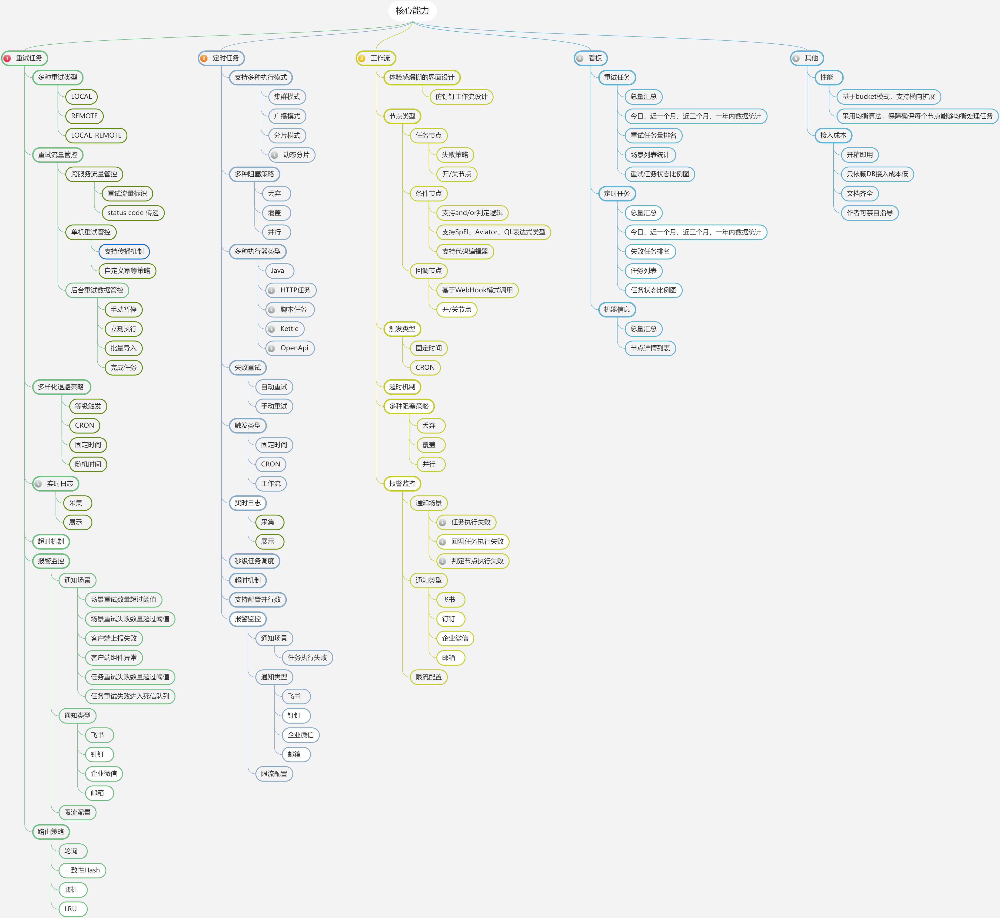

# Snail Job 介绍

Snail Job 是一个灵活、可靠且高效的分布式任务重试和任务调度平台。它的核心采用分区模式实现，具备高度可伸缩性和容错性的分布式系统。Snail Job 提供了完善的权限管理、强大的告警监控功能和友好的界面交互，是一个高性能的分布式任务调度框架，无需外部中间件即可实现秒级任务间隔调度。

> 主页预览

> 核心功能

## 官网
https://snailjob.opensnail.com/

## 开源地址

gitee: https://gitee.com/aizuda/snail-job

github https://github.com/aizuda/snail-job

## 在线体验地址
地址: https://preview.snailjob.opensnail.com/

账号: developer

密码: 123456

## 特性

### 易用性
- 轻松接入
- 文档齐全
- 视频讲解

### 高性能
- 多bucket模式
- 负载均衡算法
- 无锁化设计

### 安全性
- Token机制
- 访问控制

### 分布式重试任务
- 数据可持久化
- 避免重试风暴
- 风险可管控
- 丰富的告警场景

### 分布式调度任务
- 可视化任务编排
- 多种作业执行模式
- 丰富的调度方式
- 支持失败重试
- 多种阻塞策略
- 完善的监控报警机制
- 实时调度日志

### 其他特性
- 多样化的告警方式
- 数据大盘
- 容器化部署
- 用户管理

## 核心能力

Snail Job 的核心能力包括：

- **分布式重试模块**：支持本地和远程重试模式，支持多种退避策略，提供丰富的重试风暴管控手段。
- **分布式任务调度模块**：支持秒级任务调度，无需依赖外部中间件，支持多种执行模式如集群模式、广播模式和分片模式。

## 开源组件对比

| 项目 | Quartz | Elastic-Job | XXL-JOB | PowerJob | Snail Job |
| --- | --- | --- | --- | --- | --- |
| 定时调度 | Cron | Cron | Cron | CRON、固定频率、固定延迟、OpenAPI | 定时任务、秒级任务、固定频率 |
| 重试任务 | 不支持 | 不支持 | 不支持 | 不支持 | 支持本地&远程重试模式 |
| 任务编排 | 不支持 | 不支持 | 不支持 | 支持 | 仿钉钉工作流设计 |
| 分布式计算 | 不支持 | 静态分片 | 广播 | 支持 | 广播执行、集群执行、静态分片 |
| 多语言 | Java | Java、脚本任务 | Java、脚本任务 | 支持 | Java(已支持)、脚本任务(开发中) |
| 用户管理 | 不支持 | 支持 | 支持 | 不支持 | 完备的用户管理和权限管理 |
| 安全 Token | 不支持 | 不支持 | 支持 | 不支持 | 支持 |
| 可视化 | 无 | 弱 | 历史记录、运行日志 | 支持 | 历史记录、实时日志、监控大盘 |
| 可运维 | 无 | 启用、禁用任务 | 启用、禁用任务、手动运行任务 | 支持 | 启用、禁用任务、手动运行任务 |
| 报警监控 | 无 | 邮件 | 邮件 | 邮件 | 支持配置多种告警场景 |
| 性能 | 每次调度通过DB抢锁 | ZooKeeper是性能瓶颈 | 采用Master节点调度 | 无锁化设计 | 系统采用多bucket模式 |
| 接入成本 | 只依赖DB接入成本低 | 需引入Zookeeper | 只依赖DB接入成本低 | 依赖DB接入成本低 | 只依赖DB接入成本低 |

## 部署

Snail Job 支持多种数据库的部署，包括 MySQL、PostgreSQL、SQL Server 和 Oracle。部署步骤包括配置数据源、系统参数配置、数据库构建和启动服务。此外，Snail Job 也支持 Docker 容器部署，提供了多种数据库的 Docker 部署方案。

## 测试案例

Snail Job 提供了详细的测试案例，确保各个功能模块的正确性和稳定性。用户可以通过 SwaggerUI 访问和测试 Snail Job 的接口。

## 版权
Aizuda/SnailJob 采用APACHE LICENSE 2.0 开源协议，您在使用过程中，需要注意以下几点:

不得修改产品相关代码的源码头注释和出处;

不得应用于危害国家安全、荣誉和利益的行为，不能以任何形式用于非法目的;

## 结论

Snail Job 是一个高性能、高颜值、高活跃的分布式任务调度和分布式重试平台，适合需要快速部署和调整的任务，提供了丰富的功能和灵活的配置选项，满足不同用户的需求。
